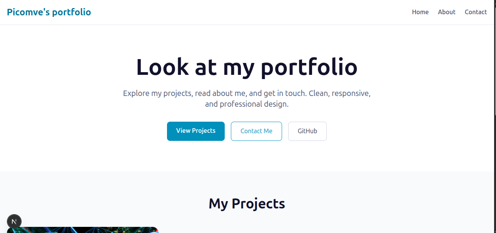

# Picomve's Portfolio App

A modern, responsive Progressive Web App (PWA) built with Next.js to showcase my development skills and projects. Clean design, fast performance, and professional presentation.



## TO-DO

- Make panel is only can be entered with a username


✔ Make contact page is working (cuz its not now)

## 🛠️ Tech Stack

- **Framework:** Next.js 16
- **Frontend:** React 19
- **Language:** TypeScript
- **Styling:** Tailwind CSS
- **Content:** React Markdown
- **Build Tool:** Next.js CLI


### Installation

1. Clone the repository:
```bash
git clone https://github.com/picomve/portfolio-app.git
cd portfolio-app
```

2. Install dependencies:
```bash
npm install
# or
yarn install
# or
pnpm install
```

3. Run the development server:
```bash
npm run dev
# or
yarn dev
# or
pnpm dev
```

4. Open [http://localhost:3000](http://localhost:3000) in your browser.

## 🎨 Customization

### Adding Projects

Edit `utils/projects.ts` to add new projects:

```typescript
{
  id: 2,
  title: "Your Project Name",
  description: "Brief project description",
  image: "/project-image.jpg",
  technologies: ["Tech1", "Tech2", "Tech3"],
  githubUrl: "https://github.com/username/project",
  liveUrl: "https://project-demo.com",
  details: `# Project Details\n\nDetailed markdown description...`
}
```

### Styling

The app uses Tailwind CSS for styling. Customize colors and design in the component files or modify the Tailwind configuration.

### Personal Information

Update the about page (`app/about/page.tsx`) and contact information as needed.

## 📜 Available Scripts

- `npm run dev` - Start development server
- `npm run build` - Build for production
- `npm run start` - Start production server
- `npm run lint` - Run ESLint

## 🌐 Deployment

### Vercel (Recommended)

1. Push your code to GitHub
2. Connect your repository to [Vercel](https://vercel.com)
3. Deploy automatically on every push

### Other Platforms

The app can be deployed to any platform supporting Node.js:
- Netlify
- Railway
- Heroku
- DigitalOcean App Platform

## 🤝 Contributing

Contributions are welcome! Please feel free to submit a Pull Request.

## 📄 License

This project is open source and available under the [MIT License](LICENSE).

## 🔗 Links

- **Live Demo:** [https://www.picomve.info](https://www.picomve.info)
- **GitHub Repository:** [https://github.com/picomve/portfolio-app](https://github.com/picomve/portfolio-app)

## 👨‍💻 About the Developer

I'm a passionate developer focused on building modern web experiences. I enjoy crafting clean UI, high-performance code, and solutions that make users happy. My skill set includes React, Next.js, TypeScript, Node.js, Tailwind CSS, and backend APIs.

---

Built with ❤️ using Next.js
